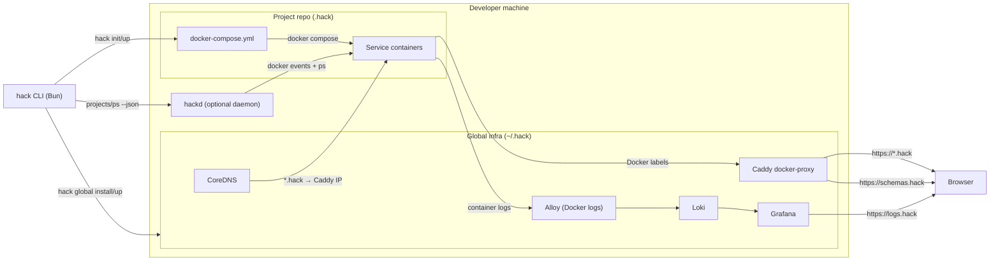
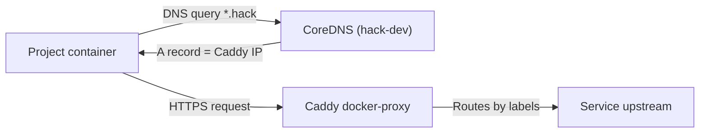
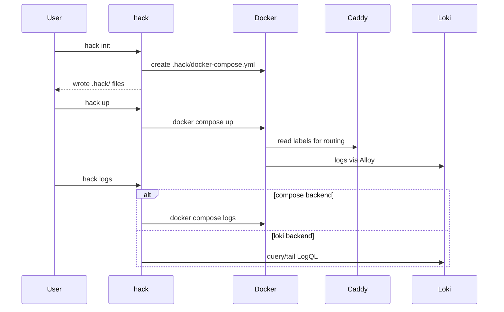
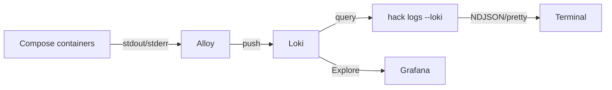
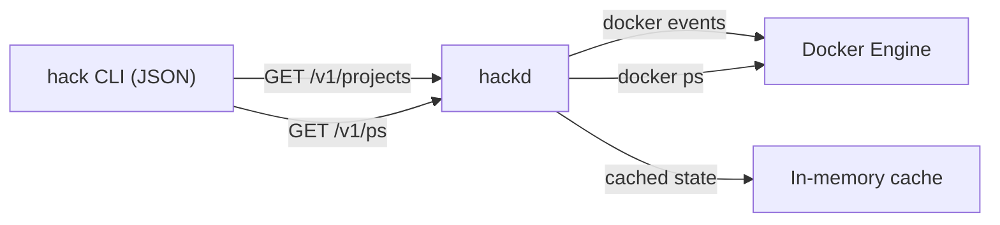
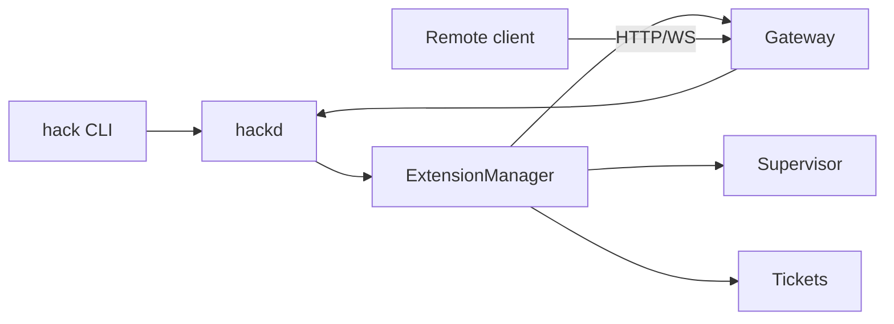

# Architecture

## Why this exists (plain English)

Running multiple local projects at the same time is messy when everything wants the same ports and
"localhost". This CLI gives each repo its own isolated network and stable HTTPS hostnames so you can:

- run many apps concurrently without port juggling
- keep service defaults (Postgres on 5432, Redis on 6379) inside each project
- access every app via predictable `https://<project>.hack`
- get fast local logs plus searchable history

## System overview
 
`hack` is a Bun CLI that writes per-project Compose files under `.hack/` and manages a machine-wide
proxy, DNS helpers, and logging stack under `~/.hack/`.

- **Caddy** (docker-proxy) routes `*.hack` based on container labels.
- **CoreDNS** resolves `*.hack` inside containers to the Caddy IP, with `extra_hosts` mappings for resolver compatibility.
- **Alloy + Loki + Grafana** capture logs and provide history.
- **Schemas** are served by Caddy at `https://schemas.hack`.
- **hackd (optional daemon)** caches Docker state for fast `hack projects --json` / `hack ps --json`.

## Global vs project scope

- Global scope (`~/.hack`)
  - Caddy proxy on 80/443 (routes via Docker labels)
  - CoreDNS for container DNS (`*.hack` → Caddy)
  - macOS DNS helper: dnsmasq + `/etc/resolver` for `*.hack` → `127.0.0.1`
  - Logging stack (Alloy → Loki → Grafana)
  - Global config: `hack.config.json` (control plane defaults + extension settings)
    - Gateway bind/port/allowWrites
  - Schemas hosted under `https://schemas.hack`
  - Networks: `hack-dev` (ingress) and `hack-logging`

- Project scope (`.hack`)
  - `docker-compose.yml` defines services + Caddy labels
  - `hack.config.json` stores project name, dev host, log preferences, OAuth alias
  - `controlPlane.gateway.enabled` marks the project as gateway-capable
  - Optional overrides:
    - `.internal/compose.override.yml` (internal DNS/TLS injection)
    - `.branch/compose.<branch>.override.yml` (branch builds)

## Internal DNS + TLS (containers)

When `internal.dns` / `internal.tls` are enabled, `hack up` writes a Compose override that:

- sets each service’s DNS to the CoreDNS container
- mounts Caddy’s local CA cert into each service
- sets common SSL env vars (Node, curl, git, requests)
- injects `extra_hosts` mappings for `*.hack` → current Caddy IP (for runtimes that ignore custom DNS)

This lets containers use the same `https://*.hack` hostnames as the host machine. If Caddy’s IP changes,
`hack status`, `hack doctor`, and the TUI will warn; `hack restart` refreshes the mapping.

 
## Lifecycle (init → up → logs)

## Logging pipeline

`hack logs` supports two backends:

- **compose**: fast, direct `docker compose logs`
- **loki**: searchable history + LogQL filters

NDJSON streaming (`hack logs --json`) emits `start`, `log`, and `end` events for MCP/TUI consumers.

Retention:
- Loki retention is set in the global Loki config (`~/.hack/logging/loki.yaml`), default `168h` in the template.
- Per-project overrides live in `hack.config.json` under `logs.retention_period` and apply when `hack down` prunes logs.

Note: the daemon does not proxy logs yet; `hack logs` still talks directly to Docker Compose or Loki.

## Daemon (hackd)

`hackd` is an optional local daemon that watches Docker events and maintains a cached view of running
containers. It serves a small local API over a Unix socket at `~/.hack/daemon/hackd.sock` and powers:

- `hack projects --json`
- `hack ps --json`
- streaming consumers (TUI/MCP)

If the daemon is not running (or version-mismatched), the CLI falls back to direct Docker calls.

Why optional:
- The CLI must keep working with zero background processes.
- Not all users need cached JSON (especially if they only use interactive commands).
- It stays off in minimal or constrained environments, but is available when you want faster status.

## Control plane + extensions

The control plane keeps the core CLI minimal while adding features as extensions. `hackd` loads
extension manifests and exposes their APIs; the CLI dispatches extension commands via `hack x`.

- **Gateway**: optional HTTP/WS access to `hackd` (localhost by default).
- **Supervisor**: job execution + streaming for agents.

### Gateway API + remote workflows

The gateway exposes:
- `GET /v1/projects` with `project_id` for remote workflow routing
- job execution + streaming (`/control-plane/projects/:id/jobs`)
- PTY-backed shells (`/control-plane/projects/:id/shells`, WS stream)

Current gateway routing:
- One gateway instance is active per machine (global config).
- Projects opt in with `controlPlane.gateway.enabled` in their project config.
- Remote clients route by `project_id` in the API paths.

For full usage, security posture, and end-to-end examples, see `gateway-api.md`.

## Branch builds

`--branch <name>` generates a per-branch Compose override that:

- prefixes hostnames (e.g. `api.myapp.hack` → `api.<branch>.myapp.hack`)
- prefixes the Compose project name

This enables parallel worktrees without port or hostname collisions.

## Files and directories

- `~/.hack/`
  - `daemon/hackd.sock`
  - `daemon/hackd.pid`
  - `daemon/hackd.log`
  - `caddy/docker-compose.yml`
  - `caddy/Corefile` (CoreDNS config)
  - `logging/docker-compose.yml`
  - `logging/alloy.alloy`
  - `logging/loki.yaml`
  - `logging/grafana/...`
  - `schemas/hack.config.schema.json`
  - `schemas/hack.branches.schema.json`
  - `certs/` (mkcert output for non-Caddy services)
  - `projects.json` (best-effort registry)

- `<repo>/.hack/`
  - `docker-compose.yml`
  - `hack.config.json`
  - `hack.branches.json` (optional)
  - `.internal/compose.override.yml`
  - `.branch/compose.<branch>.override.yml`

## Key design choices

- Docker Compose is the execution substrate for predictability and portability.
- Caddy routes by container label so there is no per-repo reverse proxy config.
- CoreDNS gives containers the same `*.hack` namespace as the host.
- Logs default to `docker compose logs` for speed; Loki is used for history and filtering.
- The optional daemon keeps CLI JSON queries fast without making it a hard dependency.
- Config lives alongside each repo in `.hack/` to keep repos isolated and portable.
- Schemas are generated from templates and served locally for editor validation.
